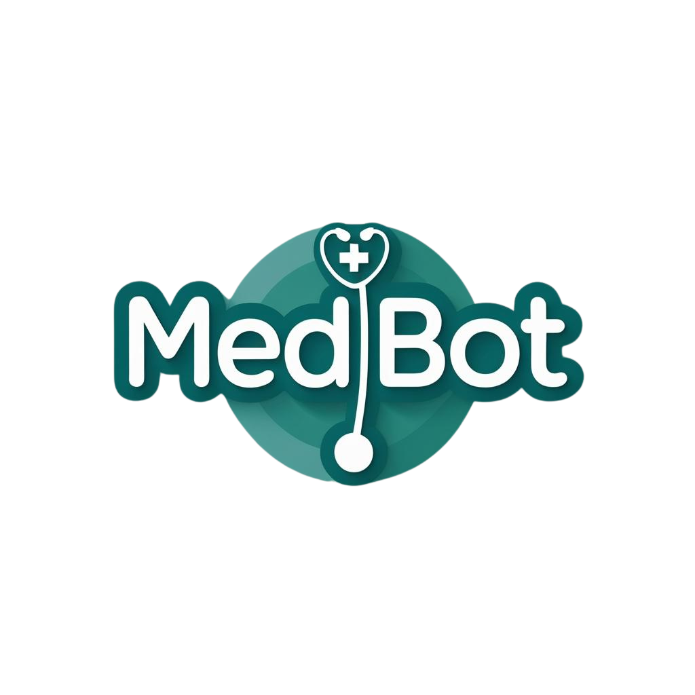

# Summer 2025 AI Research Project
## AI Medical Assistant Chatbot (using DeepSeek)

### 🩺 **Project Overview**
This project implements **MedBot**, and AI-powered medical assistant chatbot designed to provide medically relevant information based on user symptoms and questions. The chatbot integrates the **DeepSeek-R1 model** for natural language processing (NLP) and uses the **MedQuAD dataset** for accurate and reliable responses.



---

###  Key Features
- Integration with **DeepSeek-R1 model** for generating detailed medical responses.
- **Symptom selection interface** allowing users to input multiple symptoms and descriptions.
- **Nearby healthcare provider search** using the OpenStreetMap Nomination API.
- **User age and gender inputs** to personalize medical advice.
- User friendly interface designed with **Gradio**


### Setup Instructions
1. Clone the repository
   ```bash
   git clone https://github.com/Denita06/Summer-2025-AI-Research
   cd summer_research 

2. Install dependencies
    ```bash
   pip install -r requirements.txt

   

### How to Use MedBot
1. **Start the chatbot** by running:
    ```bash
   python main.py
   
2. On the web interface:
   - Enter your **age** (18 or older required) and **gender** (Male or Female)
   - Enter you **city** or **location** to find nearby healthcare providers.
3. **Select your symptoms** from the checklist:
   - Check all symptoms that apply (e.g. Fever, Cough, Headache).
   - If your symptom is not listed, select "Other" and describe it in the textbox that appears.
4. Ask your **medical question** in the textbox labeled "Your Question."
   - Example: "Why do I feel this way?"
5. **Click the "Submit" button** to send your question to MedBot.
6. **Review the response**, which will include:
   - 🔹 **Detailed medical advice** based on information retrieved from the MedQuAD dataset.
   - 🔹 **Nearby healthcare providers** in your entered city (if applicable).

